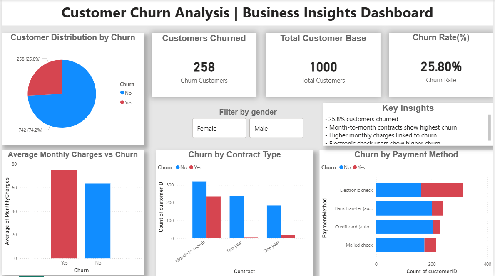

#  Customer Churn Analysis | SQL + Power BI Project

## Project Overview

This project focuses on analyzing customer churn data using SQL and Power BI to uncover patterns in customer behavior and identify key factors driving customer attrition.
The analysis combines data querying, aggregation, and visualization to generate actionable insights that can help businesses improve customer retention and reduce churn.

## Tools & Technologies

* SQL (MySQL) – Data extraction, validation, and analysis
* Power BI – Data visualization and dashboard creation
* Power Query – Data cleaning and transformation

## Dataset

Customer-level data including demographics, services, contract details, and churn status.

## Data Preparation & Modeling

* Cleaned and transformed data using Power Query
* Handled categorical inconsistencies
* Created derived columns (service flags)

## SQL Analysis

SQL was used for data validation, exploration, and identifying churn patterns.

### Key Analysis

* Total customers and churn rate
* Churn rate calculation (%)
* Average monthly charges by churn
* Churn by Contract Type
* Churn by Internet Service
* Churn by Payment Method
* Churn by Customer Type 

## SQL Visualizations

### Churn by Contract Type  


### Churn by Customer Type


### Churn by Internet Service  


### Churn by Payment Method  


## Sample SQL Query

```sql
SELECT 
  COUNT(*) AS total_customers,
  SUM(Churn = 'Yes') AS churned,
  ROUND(SUM(Churn = 'Yes') / COUNT(*) * 100, 2) AS churn_rate_pct
FROM churn_data;
```

##  Dashboard Preview



## Dashboard Features

### KPI Cards

* Total Customer Base
* Customers Churned
* Churn Rate (%)

### Visual Analysis

* Customer distribution by churn
* Churn by contract type
* Churn by payment method
* Monthly charges vs churn

### Interactive Features

* Slicers for filtering (e.g., Gender)
* Dynamic visual updates.
  
### Data Model (Star Schema)

* Fact Table: `churn_data`
* Dimension Tables: `dim_customers`, `dim_services`, `dim_billing`, `dim_contract`
* Established one-to-many relationships using `customerID`

##  Key Insights

### From SQL Analysis

* Customers with **month-to-month contracts** show the highest churn, while long-term contracts improve retention
* **Senior citizens (~39%)** are more likely to churn compared to non-senior customers
* **Fiber optic users** have higher churn rates, indicating possible dissatisfaction or pricing concerns
* Customers using **electronic check** exhibit the highest churn, while automatic payments reduce churn

### From Dashboard

* **Month-to-month contracts** have the highest churn
* **Electronic check users** show higher churn tendencies
* Customers with **lower tenure** are more likely to leave

##  Possible Solutions

* Encourage long-term contracts to reduce churn
* Offer incentives for automatic payments
* Improve fiber service experience
* Provide targeted support and benefits to senior customers

## Project Structure
```
customer-churn-analysis/
├── dataset/
├── sql_queries/
├── visuals/
├── README.md
```
## Conclusion

This project demonstrates how combining SQL analysis with Power BI visualization can effectively identify key drivers of customer churn.By understanding customer behavior patterns, businesses can take targeted actions to improve retention and enhance customer satisfaction.

## Future Improvements

* Build a predictive churn model using Machine Learning
* Add advanced Power BI features (drill-through, tooltips)
* Deploy the dashboard for real-time insights

## Author

**Sneha Chaudhari**

Aspiring Data Analyst | MMS (IT) Student

* Interested in data analytics, business insights, and problem-solving
* Actively building projects in SQL, Power BI, and Python

